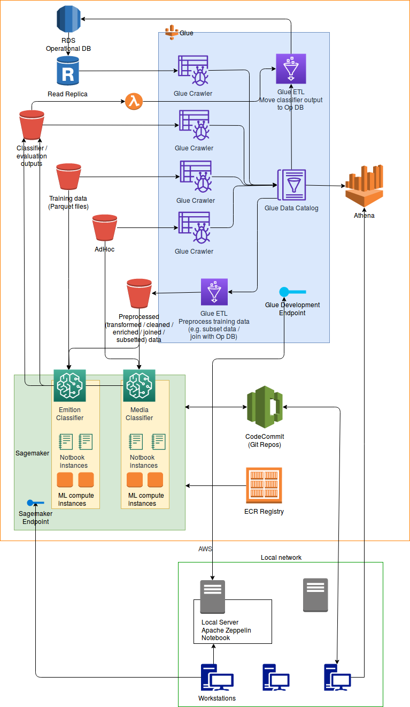

# Requirements

The original specification with more context can be found [here](https://www.dropbox.com/s/iu9s8kchrpabuxu/homework.zip?dl=0&file_subpath=%2Fhomework%2FREADME.md).

## Functional
Data analysts need to be able to:
        
- Train an emotion classifier on a selected subset of a training data optionally joined with data from the operational DB.
- Validate a trained emotion classifier on the test split of the data and 
  - store the results of the validation somewhere and
  - store the outputs (happy, angry, sad labels) of the trained classifier in the operational DB.
- Train media classifier using 
  - the output of the emotion classifier as features
  - and the ground truth data from the ad hoc data as labels.
- Validate media classifier with cross-validation and store results in the operational DB.
- Obtain statistics about the
  - operational DB,
  - training data,
  - ad hoc data,
  - combination of these.
            
## Non-Functional
    
- Reduce bandwidth usage between local network and AWS.
  - Avoid frequently loading the entire emotion output data from AWS to local servers.
- Training models should not block queries in the operational DB.
- There are approximately 15 workstations in the local network that need to be served by the system.

# Out of Scope

The following aspects are not addressed in this doc:

- How to add more raw data (training data, ground truth data) to the system.
- Logging, monitoring, alarms.
- VPC setup (VPC, subnets, internet gateways, security groups, NACLs).
- Security (data in transit, data at rest, IAM, authentication, authorization of users).
- How data aggregation/transformation between the operational DB and ad hoc data happens.
- How to deploy and use the trained models to make predictions/classify new data.
- In-depth price analysis.
- Regionalization. (However, regionalization probably would not be an issue here as this system is only accessed by data scientists from one local network.)

# Overall Approach

In this document I mostly favored fully managed services over "just managed" services.

Not fully managed services usually offer more control and flexibility and often they can be cheaper than fully managed services. However, they require more setup and infrastructure management, which entails more complexity.

In this task I tried to keep the approach simple and therefore I tried to pick fully managed services wherever possible beacuse of their simplicity.

# Architecture

## Data Stores

### Operational DB - RDS

As it was specified in the task the operational DB is stored in RDS.

We setup a read replica instance so that the read-heavy workloads of ETL jobs (and classifier training algorithms if they directly use the operational DB) are offloaded from the master instance. The master instance will only handle the insertion of new data to the DB.

### Ad Hoc Data - S3

The ad hoc data consists of .csv files, which can easily be stored in S3. There is no need to parse the .csv files and insert them into a database. Furthermore, there is no need to manage infrastructure, and S3 can easily be integrated with Glue too.

### Training Data - S3

The training data consists of parquet files, which can also be stored in S3.

(Another possibility to store parquet files would be to launch an EMR cluster and store the parquet files in HDFS. However, this seems too complicated as [we would need to manage the instances in the cluster](https://aws.amazon.com/emr/), and we do not want to use EMR to process this data anyways.)

### Processed Data - S3

#### Preprocecssed Data

In this architecture we use SageMaker for machine learning tasks. SageMaker [can pull training data from S3](https://aws.amazon.com/sagemaker/faqs/). Since the preprocessed data will be used by the ML algorithms running in SageMaker, we store the preprocessed data in an S3 bucket.

#### Classifier Output

SageMaker [can save its outputs in S3](https://docs.aws.amazon.com/sagemaker/latest/dg/automatic-model-tuning-ex-bucket.html), so we use an S3 bucket for storing the output of the training algorithms and model evaluations.

## Data Processing (ETL) - AWS Glue

We use AWS Glue for data preprocessing, which includes e.g. selecting a subset of the training data or joining the training data with other data from the operational DB.

[AWS Glue](https://aws.amazon.com/glue/) is a fully managed ETL service (it uses Apache Spark under the hood). It can be used to clean, transform, join datasets and load it to various data stores (like RDS or S3) in AWS.

First, we need to [define crawlers](https://docs.aws.amazon.com/glue/latest/dg/add-crawler.html) for the different data sources and the crawlers will populate the AWS Glue Data Catalog with tables. (Glue has many [built-in classifiers](https://docs.aws.amazon.com/glue/latest/dg/add-classifier.html) for crawlers that can discover different data formats including parquet files.)

Then we can [create jobs](https://docs.aws.amazon.com/glue/latest/dg/how-it-works.html) using table definitions in the Data Catalog. Jobs consist of scripts that contain the programming logic that performs the transformation. AWS Glue can generate a script to transform the data data. Or, users can provide the script in the AWS Glue console or API.

**Note**: The outputs of the emotion classifiers (*Classifier / evaluation outputs* bucket) is also picked up by Glue crawlers and a Glue ETL job loads it back to RDS as it was required in the specifications: "*in operation database those labels (angry, sad, happy) are results of our classifiers output*" (from the clarification email).
Then from the RDS DB it is also picked up by another Glue job and loaded into the *Preprocessed data* bucket, so that the media classifier in SageMaker can use the outputs of the emotion classifiers as features.

### Glue Job Development - Apache Zeppelin Notebook

AWS Glue can [create an environment](https://docs.aws.amazon.com/glue/latest/dg/dev-endpoint.html) for the iterative development and testing of ETL scripts. 

There are a few different ways of using a development endpoint. Here we use an Apache Zeppelin Notebook installed on one of the local servers. Users can connect to it from a browser on a workstation to debug and test ETL scripts on the development endpoint.

### Triggering Glue Jobs - On-Demand, Lambda

[Jobs can be run](https://docs.aws.amazon.com/glue/latest/dg/components-key-concepts.html) on demand or initiated by a trigger, which can be a time-based schedule or an event.

- The ETL jobs for joining and subsetting datasets for model training can be executed on demand by data scientists in the Glue console.
- The ETL job for moving the classifier outputs and the results of the model evaluations from S3 to the operational DB can be triggered by a lambda that is triggered when a new object is created in the corresponding S3 bucket.

## Machine Learning - SageMaker

[Amazon SageMaker](https://docs.aws.amazon.com/sagemaker/latest/dg/whatis.html) is a fully managed machine learning service for building, training and deploying machine learning models.

Data scientists can use [Jupyter notebooks running on Amazon SageMaker notebook instances](https://docs.aws.amazon.com/sagemaker/latest/dg/nbi.html) for the  [entire machine learning workflow](https://docs.aws.amazon.com/sagemaker/latest/dg/how-it-works-mlconcepts.html) including fetching and preprocessing data and training and evaluating ML models.

An Amazon SageMaker [notebook instance](https://docs.aws.amazon.com/sagemaker/latest/dg/nbi.html) is a fully managed ML compute instance.
Using the Amazon SageMaker Notebook module [improves the efficiency](https://aws.amazon.com/blogs/machine-learning/run-sql-queries-from-your-sagemaker-notebooks-using-amazon-athena/) of interacting with the data without the latency of bringing it locally.

### Model Training - Compute Instances and ECR

[To train a model](https://docs.aws.amazon.com/sagemaker/latest/dg/how-it-works-training.html) in Amazon SageMaker, a data scientist has to create a training job. The training job includes the following information:

- The URL of the S3 bucket where the training data is stored.
- The compute resources that Amazon SageMaker will use for model training. Compute resources are ML compute instances that are managed by SageMaker.
- The URL of the S3 bucket where you want to store the output of the job.
- The Amazon Elastic Container Registry (ECR) path where the training code is stored.

SageMaker has many built-in classification models, however, [custom models](https://docs.aws.amazon.com/sagemaker/latest/dg/your-algorithms.html) can also be used (need to package the custom algorithm into a Docker image).

### Collaborative and Version-Controlled Classifier Development - CodeCommit

SageMaker [can be connected](https://aws.amazon.com/blogs/machine-learning/amazon-sagemaker-notebooks-now-support-git-integration-for-increased-persistence-collaboration-and-reproducibility/) to a remote Git repository, which allows data scientists to collaboratively develop Jupyter notebooks and store them in a version control system.

"Additionally, notebooks in a notebook instance [are stored on durable Amazon Elastic Block Store](https://aws.amazon.com/blogs/machine-learning/amazon-sagemaker-notebooks-now-support-git-integration-for-increased-persistence-collaboration-and-reproducibility/) (EBS) volumes. However, they don’t persist beyond the life of the notebook instance. That means that if you delete your notebook instance, you will lose your work. Storing notebooks in a Git repository enables you to decouple Jupyter Notebooks from the instance lifecycle and keep them as standalone documents that can be referenced and reused in the future."

In the current architecture we use CodeCommit, which is a Git-based version control system offered by AWS.
        
### Storing Outputs - S3

As it was mentioned before SageMaker can save its outputs to S3, so we use an S3 bucket to store the results of the evluation of classifiers and the outputs of the emotion classifiers that will be used as features in the media classifiers.

Some of the outputs are then loaded into the operational DB from S3 (by Glue jobs) as it was described in the previous sections.

## Querying Datasets - Athena

Glue can provide a [unified view](https://aws.amazon.com/glue/) of data across multiple data stores. Once the The AWS Glue Data Catalog is constructed from the various data sources, it can be used for search and query [using Amazon Athena](https://docs.aws.amazon.com/athena/latest/ug/glue-athena.html).
    
[Athena](https://aws.amazon.com/athena/) provides an interactive query editor in the AWS console where users (data scientists) can write queries using standard SQL. Athena can also be [accessed](https://docs.aws.amazon.com/athena/latest/ug/accessing-ate.html) through a JDBC or ODBC connection, using the Athena API, or using the Athena CLI. 

---------------------------------------------------------

# Appendix

## Other Options for Joining/Preprocessing Datasets Directly from SageMaker Notebooks

A slightly different approach for joining/subsetting/preprocessing data from multiple sources can be found [here](https://aws.amazon.com/blogs/machine-learning/access-amazon-s3-data-managed-by-aws-glue-data-catalog-from-amazon-sagemaker-notebooks/). In this approach all the preprocessing (including joins and subset selection) is done directly from SageMaker notebooks, so there is no need for data scientists to interact with a separate ETL service.

This approach uses an Amazon EMR cluster (running Apache Spark and Apache Livy) and using AWS Glue Data Catalog (as the Amazon EMR external Hive metastore). (Glue also uses Apache Spark under the hood, but it is fully managed by Glue.)

- **Pros**: data scientist only need to interact with SageMaker notebooks to train models. Do not need to define separate Glue jobs.
- **Cons**: an EMR cluster has to be set up (with Livy and Spark) and managed. EMR is not fully managed (e.g. number/type of instances have to be specified).
- **Note**: it is also possible to [develop Glue ETL scripts from SageMaker notebooks](https://docs.aws.amazon.com/glue/latest/dg/console-notebooks.html). On the AWS Glue notebooks page, the user can create Amazon SageMaker notebooks and attach them to a development endpoint.

## Using the Local Servers

In the architecture above only one of the local servers is used. It hosts a notebook server. However, there are [other options](https://docs.aws.amazon.com/glue/latest/dg/dev-endpoint.html) for developing Glue notebooks:

- A notebook server can also be setup on an EC2 instance.
- A developer (data scientist) can open a terminal window to connect directly to a development endpoint.
- It is also possible to develop Glue ETL scripts from SageMaker notebooks.

I.e. what the local server does can be quite easily done in other ways as well.

Another possible option for using the local servers would be setting up a [storage gateway](https://aws.amazon.com/storagegateway/), which can integrate a local server with S3 so that data is accessible by the workstations from the local servers, but it is also stored durably in S3.

There are different [storage gateway types](https://aws.amazon.com/storagegateway/features/#Gateway_Types). For this use-case the most suitable type probably would be a Volume Gateway in cached mode, so that the dataset is stored in S3 and only a frequently used subset of the data is stored locally.

Once a storage gateway is setup we can also use the local servers for data analysis or model training/evaluation. Since the storage gateway keeps a copy of the frequently used data, we do not need to pull the entire training dataset every time we want to train a new model.

## Alternative Option for Moving Classifier Outputs from S3 to RDS

In the current architecture Glue jobs are used to move the outputs of the classifiers from S3 to RDS. However, there are other options as well to move data from S3 to RDS. Two frequently used methods to do this are the following:

- Using [Amazon Data Pipeline](https://aws.amazon.com/datapipeline/). For Data Pipeline we need to manage the resources ourselves, so it requires additional infrastructure management.
- Using a Lambda that loads the data into RDS. The Lambda can be triggered by S3 events. Glue is designed to work with large datasets, while Lambdas suit better smaller datasets. Since the "*emotion output data is relatively big (up to hundred gigabytes)*", Glue seems to be a better choice here. Also, Lambdas have a [max memory limit of 3,008 MB](https://docs.aws.amazon.com/lambda/latest/dg/limits.html), which would be a problem here.

## Visualizing Query Results

A frequently used setup is to use QuickSight on top of Athena. [Quicksight](https://aws.amazon.com/quicksight/) a fully managed service for creating and publishing interactive dashboards that visualize insights of the data. However, as this feature was not specified in the task, it did not get added to the architecture.

## Accessing Athena Query Results from SageMaker Notebooks

SageMaker notebooks [can be integrated directly with Athena](https://aws.amazon.com/blogs/machine-learning/run-sql-queries-from-your-sagemaker-notebooks-using-amazon-athena/) too, so that query results from Athena are accessible from SageMaker Jupyter notebooks. This is another possible extension/addition to the current architecture.

## Alternatives to Glue

There are quite a few alternatives to AWS Glue. E.g. Data pipeline, EMR, Batch. Glue was picked for the following reasons:

  - Athena is out-of-the-box integrated with AWS Glue Data Catalog.
  - Dev endpoint, where data scientists can experiment with/write new ETL jobs.
  - Fully managed (no infrastructure provisioning).

However, there are downsides too, see the *AWS Product Integrations* section on the [Glue FAQs](https://aws.amazon.com/glue/faqs/) page for more details.

